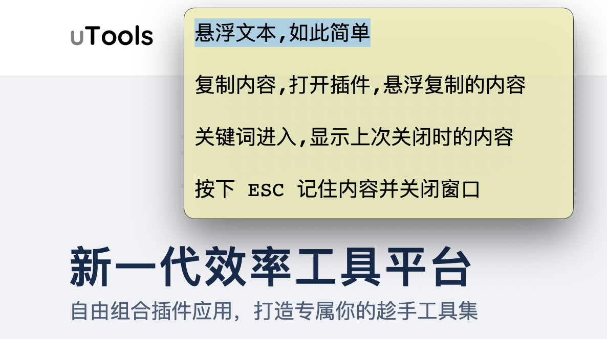
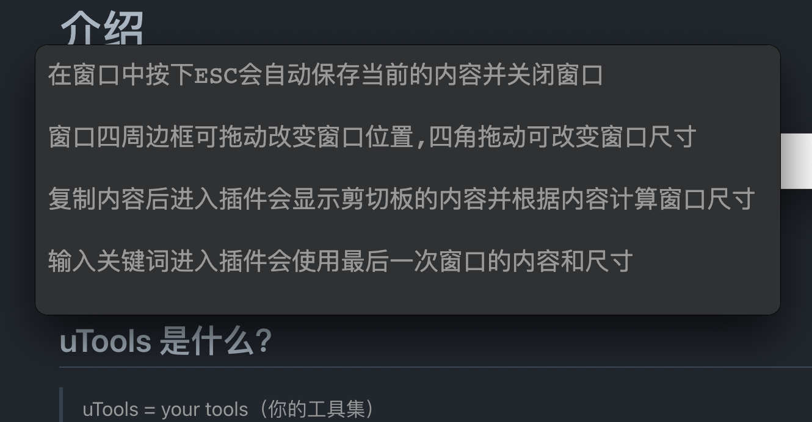
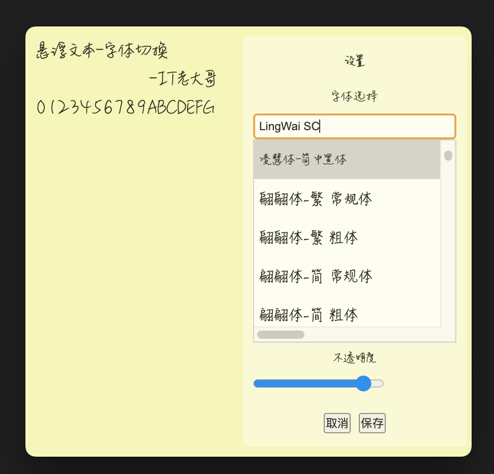

# 悬浮文本

悬浮文本,如此简单

  <a target="_blank" href='https://gitee.com/itldg/utools-suspension-text'></img></a>
  

在窗口中按下 ESC 会自动保存当前的内容并关闭窗口

窗口四周边框可拖动改变窗口位置,四角拖动可改变窗口尺寸

复制内容后进入插件会显示剪切板的内容并根据内容计算窗口尺寸

输入关键词进入插件会使用最后一次窗口的内容和尺寸

根据系统主题自动切换深色/浅色主题

可通过快捷键+鼠标滚动调整字体大小,保存文件等

支持自定义颜色,透明度,字体等

## 快捷键

-   `esc` 关闭窗口
-   `连按2次 esc` 关闭窗口并清空内容
-   `ctrl + 鼠标滚轮` 放大缩小字体
-   `ctrl + s` 保存内容到到文件

## 代码开源

代码已开源:[GitHub](https://github.com/itldg/utools-suspension-text) [Gitee](https://gitee.com/itldg/utools-suspension-text)

欢迎大家添砖加瓦
